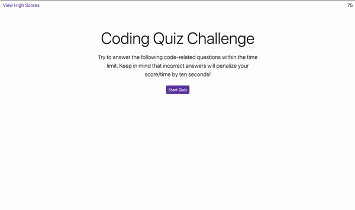

# my-javascript-coding-quiz

## Table of Contents

* [Objective](#Objective)
* [Description](#Description)
* [Installation](#installation)
* [Usage](#usage)
* [Credits](#credits)

 ## Objective
 
 - To build a timed coding quiz with multiple choice questions with a high score page.
 
 ## Description
 
 [GitHub](https://github.com/mbostwick1/my-javascript-coding-quiz)
 
 [Live URL](https://mbostwick1.github.io/my-javascript-coding-quiz/)
 
 - This project combined a little of everything we have learned so far with a heavy emphasis on Web API's.

## Installation
 
 - Created a repo on GitHub and cloned it to my local drive.
 
 - Created all files needed (2 html, css, and 2 js) and saved in my homework folder.
 
 - To make things easier, I added bootstrap and stylized some of the consistent elements.

 - I added a nav bar with a View High Scores link and Timer with a placeholder.

 - Named as many variables as I could think of and created a startQuiz function. Once I got all text populating and the first page looking good, I knew I had a good base.

 - I created 1 question to begin with so I could work out all formatting, dynamic elements, etc.

 - Once I could run through all of my questions, I worked on the correct/wrong answer responses at the footer.

 - Created the timer and added a 3 second interval for the correct/wrong answers to display.

 - I added in the correct/wrong answer functions to also deduct 10 seconds when the user gets it incorrect.

 - I created the remaining individual question functions and in hindsight, it probably would have been better to build an as 1 that generated through all questions. By the time I thought of it, I didn't think it was worth going back. While there is a bit of repeating, I don't feel like this is an inefficient way, necessarily.

 - Next I fixed a few minor styling issues and created the high scores page.

 - Working with the values and local storage was very challenging for me. It was a lot of trial error and lots of going back through activities. I ended up reworking the local storage because it was not storing as an array AND the scores would be overwritten every time by a new user.

 - Once the high scores page was populating, I made a few minor tweaks and made sure that the user would be redirected to the initals form page if the seconds hit zero.
        
 
 ## Usage

## Credits
[Bootstrap](https://getbootstrap.com/docs/4.5/components/)
[Stack Overflow Forums](https://stackoverflow.com/)
[W3 Schools JS](https://www.w3schools.com/js/)
[MDN web docs](https://developer.mozilla.org/en-US/)
